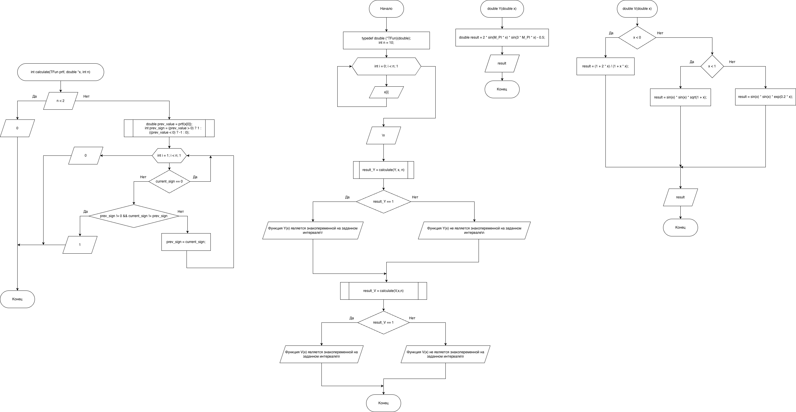

# Домашнее задание к работе 22

## Условие задачи

##### Реализовать функцию calculate (TFun prtf, double *x, int n), которая по заданной указателем prtf функции для значений массива х, размера n, проверяющую является ли функция знакопеременной на заданном интервале.
---
## 1. Алгоритм и блок-схема

### Алгоритм
1. Начало
2. Определение типа указателя на функцию: `typedef double (*TFun)(double);`

3. Объявление прототипов функций: 
	
```c
double Y(double x);
double V(double x);
int calculate(TFun prtf, double *x, int n);
```


4. Инициализация переменных:

```c
int n = 10;
double x[10];
int result_Y, result_V;
```
5. Вывод информации о функциях:
	1. Вывод формулы `Y(x) = 2*sin(πx)*sin(3πx) - 0.5`
	2. Вывод формул для кусочной функции V(x)
```c
	printf("Дано:\n");
	puts("Y(x) = 2*sin(πx)*sin(3πx) - 0.5");
	puts("При 𝑥 < 0: 1+2x/1+x^2");
	puts("При 0 ≤ 𝑥 < 1: (sin(x * √(1 + x)))^2");
	puts("При 𝑥 ≥ 1: (sin (x))^2 * e^(0.2 * x)");
```
6. Ввод данных:

```c
for (int i = 0; i < n; i++)
{
    printf("Введите значение x: ");
    scanf("%lf", & x[i]);
}
```

7. Проверка знакопеременности функции `Y(x)` c помощью функции `calculate(Y, x, 10)` и сохранение результат в переменную `result_Y`'
8. Если `result_Y` равна 1, то выводится `Функция Y(x) является знакопеременной на заданном интервале`, иначе выводится `Функция Y(x) не является знакопеременной на заданном интервале`
9. Проверка знакопеременности функции `V(x)` c помощью функции `calculate(V, x, 10)` и сохранение результат в переменную `result_V'
10. Если `result_V` равна 1, то выводится `Функция V(x) является знакопеременной на заданном интервале`, иначе выводится `Функция V(x) не является знакопеременной на заданном интервале`
11. Алгоритм функции `int calculate(TFun prtf, double *x, int n)`:
	- Проверка количества точек, если количество точек недостаточно, то возвращаем 0 (`if (n < 2) { return 0;}`, иначе
		1. Вычисляем первое значение и его знак:
	```c
	double prev_value = prtf(x[0]);
	int prev_sign = (prev_value > 0) ? 1 : ((prev_value < 0) ? -1 : 0);
	```
		2. Проверяем остальные точки:
	```c
	for (int i = 1; i < n; i++)
	{
	    double current_value = prtf(x[i]);
	    int current_sign = (current_value > 0) ? 1 : ((current_value < 0) ? -1 : 0);
	    // Если функция принимает нулевое значение, считаем это изменением знака
	    if (current_sign == 0)
	    {
	        continue; // пропускаем нулевые значения
	    }

	    // Если знак изменился по сравнению с предыдущим ненулевым значением
	    if (prev_sign != 0 && current_sign != prev_sign)
	    {
	        return 1; // Функция знакопеременная
	    }
	    prev_sign = current_sign;
	}
	```
		1. Если знак не менялся, то возвращаем 0: `return 0;`
### Блок-схема

  



  

  

[Ссылка на draw.io](https://viewer.diagrams.net/?tags=%7B%7D&lightbox=1&highlight=0000ff&edit=_blank&layers=1&nav=1&title=%D0%94%D0%97%20%E2%84%9622.drawio&dark=auto#Uhttps%3A%2F%2Fdrive.google.com%2Fuc%3Fid%3D1qAkBUZJ2xKpRsZpXUq44i967WszvyRxI%26export%3Ddownload)

  

---

  

  

## 2. Реализация программы

  

```c
#include <stdio.h>
#include <math.h>
#include <locale.h>

// Объявление типа указателя на функцию
typedef double( * TFun)(double);

// Прототипы функций
double Y(double x);
double V(double x);
int calculate(TFun prtf, double * x, int n);

int main()
{
    setlocale(LC_ALL, "RUS");
    int n = 10;
    double x[10];
    int result_Y, result_V;
    
    printf("Дано:\n");
    puts("Y(x) = 2*sin(πx)*sin(3πx) - 0.5");
    puts("При 𝑥 < 0: 1+2x/1+x^2");
    puts("При 0 ≤ 𝑥 < 1: (sin(x * √(1 + x)))^2");
    puts("При 𝑥 ≥ 1: (sin (x))^2 * e^(0.2 * x)");
    printf("\nВвод %d исходных значений x:\n", n);
    for (int i = 0; i < n; i++)
    {
        printf("Введите значение x: ");
        scanf("%lf", & x[i]);
    }
    printf("\n");

    result_Y = calculate(Y, x, n);

    if (result_Y == 1)
    {
        printf("Функция Y(x) является знакопеременной на заданном интервале\n");
    }
    else
    {
        printf("Функция Y(x) не является знакопеременной на заданном интервале\n");
    }

    result_V = calculate(V, x, n);

    if (result_V == 1)
    {
        printf("Функция V(x) является знакопеременной на заданном интервале\n");
    }
    else
    {
        printf("Функция V(x) не является знакопеременной на заданном интервале\n");

    }

    return 0;

}

// Функция проверки знакопеременности
int calculate(TFun prtf, double * x, int n)
{
    if (n < 2)
    {
        return 0; // Недостаточно точек для анализа
    } else
    {
        // Вычисляем первое значение и его знак
        double prev_value = prtf(x[0]);
        int prev_sign = (prev_value > 0) ? 1 : ((prev_value < 0) ? -1 : 0);

        // Проверяем остальные точки
        for (int i = 1; i < n; i++)
        {
            double current_value = prtf(x[i]);
            int current_sign = (current_value > 0) ? 1 : ((current_value < 0) ? -1 : 0);
            // Если функция принимает нулевое значение, считаем это изменением знака
            if (current_sign == 0)
            {
                continue; // пропускаем нулевые значения
            }

            // Если знак изменился по сравнению с предыдущим ненулевым значением
            if (prev_sign != 0 && current_sign != prev_sign)
            {
                return 1; // Функция знакопеременная
            }

            prev_sign = current_sign;

        }

        return 0; // Знак не менялся - функция не знакопеременная
    }

}

//--- Математические функции ---

double Y(double x)
{
    double result = 2 * sin(M_PI * x) * sin(3 * M_PI * x) - 0.5;
    return result;
}

double V(double x)
{
    double result;
    if (x < 0)
    {
        result = (1 + 2 * x) / (1 + x * x);
        return result;
    } 
    else if (x < 1)
    {
        result = sin(x) * sin(x) * sqrt(1 + x);
        return result;
    }
    else
    {
        result = sin(x) * sin(x) * exp(0.2 * x);
        return result;
    }
}
```

# 3. Результаты работы программы

```bash
Дано:
Y(x) = 2*sin(πx)*sin(3πx) - 0.5
При 𝑥 < 0: 1+2x/1+x^2
При 0 ≤ 𝑥 < 1: (sin(x * √(1 + x)))^2
При 𝑥 ≥ 1: (sin (x))^2 * e^(0.2 * x)

Ввод 10 исходных значений x:
Введите значение x: -4
Введите значение x: -3
Введите значение x: -2
Введите значение x: -1
Введите значение x: 0
Введите значение x: 1
Введите значение x: 2
Введите значение x: 3
Введите значение x: 4
Введите значение x: 5

Функция Y(x) НЕ является знакопеременной на заданном интервале
Функция V(x) является знакопеременной на заданном интервале
```
# 4. Информация о разработчике
#### Сафонов Павел Романович бИПТ-251